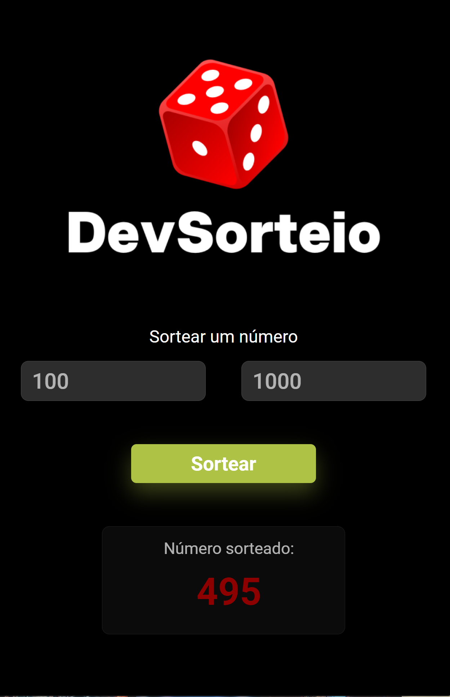

# Módulo Javascript: Criando um Sorteador de números aleatórios

Segue abaixo Projeto prático do módulo de JavaScript da Trilha FullStack-PRO do DevClub! Nele, foi proposto a criação de um Sorteador de números aleatórios utilizando a propriedade Math.random.

[Clique aqui](https:) para acessar o resultado final do projeto proposto.

obs- acrescentei ao projeto a responsividade trabalhada no módulo de CSS e também adicionei ao projeto um espaço dedicado ao número sorteado, bem como a inserção de alertas para que todos os campos sejam preenchidos e para que o primeiro campo obtenha um valor menor do que o adicionado no segundo campo.
